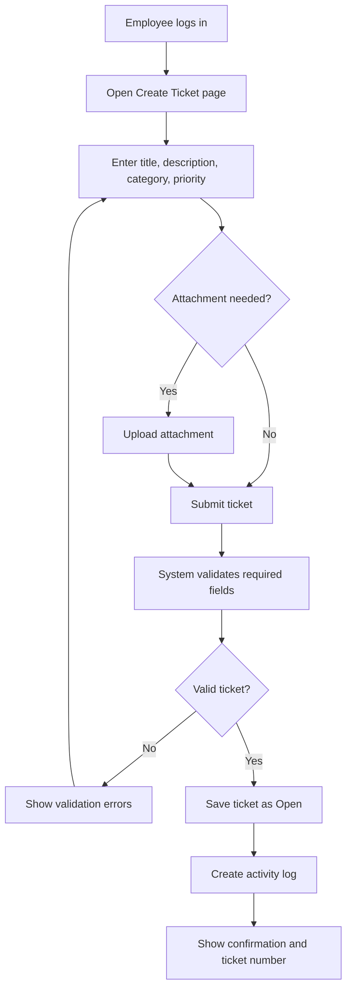
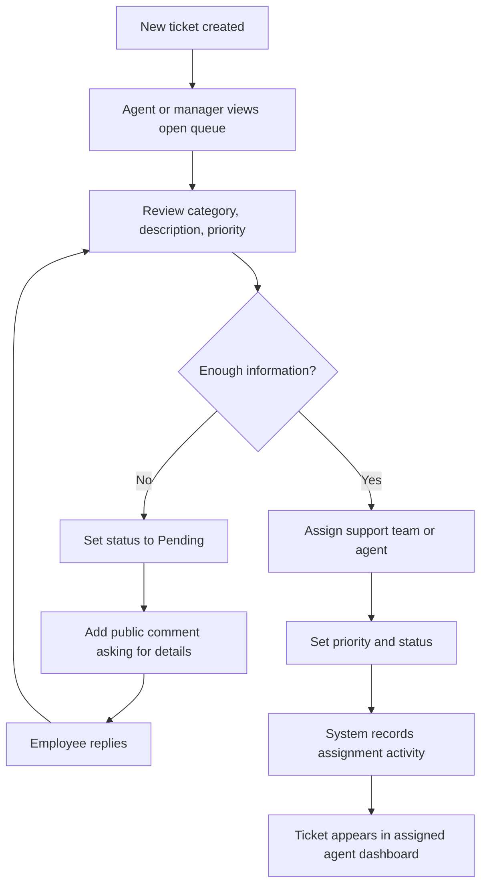
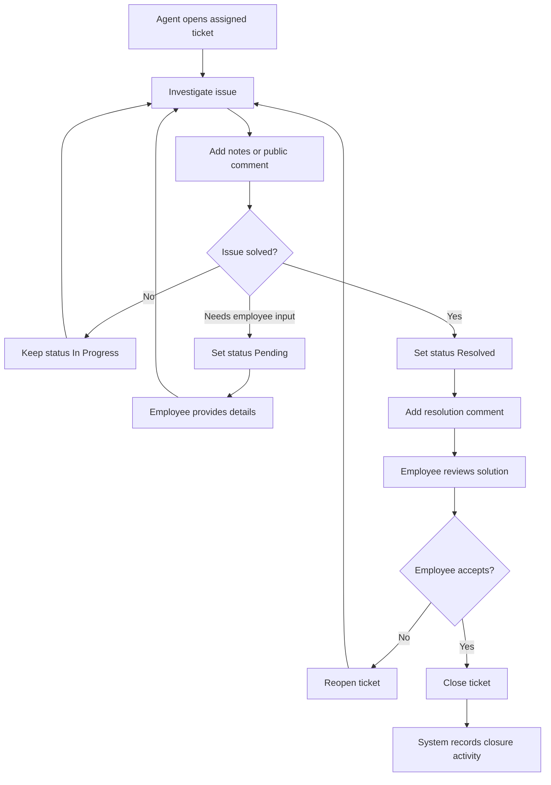
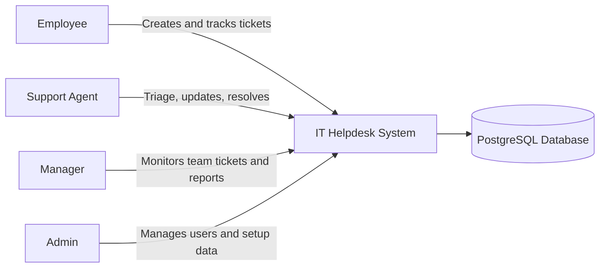

# System Workflow Diagrams

Project: IT Helpdesk Ticketing System

Team: Issam Fawaz and Adam Diab

## 1. Ticket Submission Workflow

## 2. Ticket Assignment and Triage Workflow

## 3. Ticket Resolution and Closure Workflow

## 4. High-Level User Role Workflow

